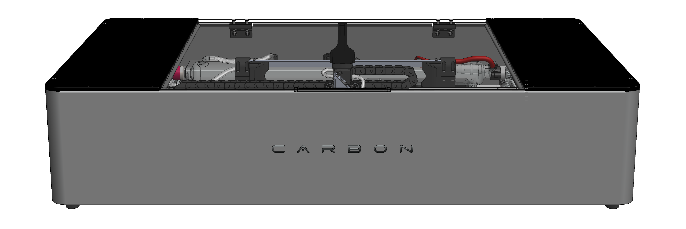

---
hide:
    - navigation
#    - toc
---
# OLÁ COMO PODEMOS AJUDAR?

<figure markdown="span">

  { width="1000" }
  <figcaption></figcaption>

</figure>

## Bem vindo ao centro de conhecimento Carbon

-   :fontawesome-solid-book-open:{ .lg .middle } __Manual de instuções__

    ---

    Nesta secção encontra tudo o que precisa sobre os manuais da Carbon assim como fazer donload dos mesmos.

    [:octicons-arrow-right-24: Saber Mais](https://gadgetpluskdb.github.io/Carbon-FAQS/manual/)

-   :fontawesome-solid-screwdriver-wrench:{ .lg .middle } __Ajuda com manutenção__

    ---

    Precisa de informação sobre como fazer qualquer tipo de manutenção na sua Carbom, então aqui é o lugar.

    [:octicons-arrow-right-24: Saber Mais](https://gadgetpluskdb.github.io/Carbon-FAQS/manuten%C3%A7%C3%A3o/%C3%A1gua/agua-na-carbon/)

-   :fontawesome-brands-app-store:{ .lg .middle } __Ajuda com o Carbon Studio__

    ---

    Dos primeiros passos com o Carbon Studio, até á ajuda avançada, aqui vai encontrar varios artigos para a sua formação com o software.

    [:octicons-arrow-right-24: Saber Mais](https://gadgetpluskdb.github.io/Carbon-FAQS/studio/instalar-software/)

-   :fontawesome-solid-triangle-exclamation:{ .lg .middle } __Resolução de problermas__

    ---

    Tem algum problema com a sua maquina? Encontre aqui algumas soluções simples que o podem ajudar bastante.

    [:octicons-arrow-right-24: Saber Mais](https://gadgetpluskdb.github.io/Carbon-FAQS/troubleshooting/corte-diferente/ajustar-correias/)

-   :fontawesome-solid-helmet-safety:{ .lg .middle } __Ajuda com Segurança__

    ---

    O seguro morreu de velho, sabia tudo sobre como trabalhar em segurança com a sua Carbom.

    [:octicons-arrow-right-24: Saber Mais](https://gadgetpluskdb.github.io/Carbon-FAQS/seguran%C3%A7a/instruc%C3%B5es-seguranca/)

-   :fontawesome-solid-wand-magic-sparkles:{ .lg .middle } __Aprender com truques e dicas__

    ---

    Deseja aprender só mais um pouquinho? Então é aqui...

    [:octicons-arrow-right-24: Saber Mais](https://gadgetpluskdb.github.io/Carbon-FAQS/truques-%26-dicas/vetorizar-imagem/)          

## Não encontrou o que procurava?

Entre em contacto connossco diretamente, estamos aqui para ajudar.

<!DOCTYPE html>
<html lang="en">
<head>
    <meta charset="UTF-8">
    <meta name="viewport" content="width=device-width, initial-scale=1.0">
    <title>Document</title>
    <link rel="stylesheet" href="https://cdnjs.cloudflare.com/ajax/libs/font-awesome/6.0.0-beta3/css/all.min.css">
</head>

    <a href="https://api.whatsapp.com/send?1=pt_pt&phone=351939039730" class="md-button" style="width: 200px; height: 54px;">
        Whatsapp <i class="fab fa-whatsapp" style="vertical-align: middle;"></i>
    </a>

    <a href="mailto:contacto@gadgetplus.pt" class="md-button" style="width: 200px; height: 54px;">
        E-mail <i class="fas fa-paper-plane" style="vertical-align: middle;"></i>
    </a>

