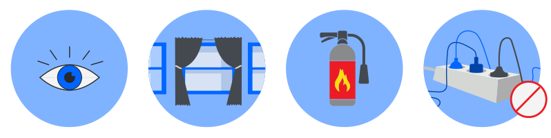
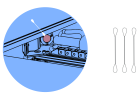
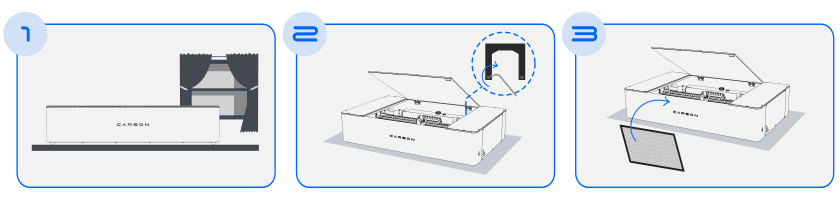

# Manual Online

## Seja bem vindo ao manual online

É com imensa alegria que te parabenizamos pela aquisição deste produto.
Este é o Guia de Instruções da Máquina de Corte e Gravação a Laser Carbon, uma criação inovadora da empresa Gadget.

A Carbon é uma máquina que combina comodidade, precisão e eficiência num único dispositivo, representando uma solução acessível sem comprometer a excelência.

Aqui encontram-se todas as informações essenciais para os utilizadores aproveitarem ao máximo os recursos e possibilidades deste produto, desde a configuração inicial até às dicas avançadas de operação.

Estamos entusiasmados por vos ter a bordo nesta jornada de descoberta e concretização com a Máquina de Corte e Gravação a Laser Carbon.
Em nome de toda a equipa da Gadget, vos desejamos experiências incríveis e
resultados impressionantes.

Bem-vindos ao futuro da tecnologia de corte e gravação a laser!

## Instriuções de segurança

<figure markdown="span">

  { width="700" }

  <figcaption></figcaption>
</figure>

* NUNCA deixe a máquina a operar sozinha sem a supervisão de um profissional qualificado, especialmente em longos trabalhos de corte ou gravação.
* Não ligar o cabo de alimentação da máquina a uma extensão com várias
dispositivos simultaneamente.
* Certifique-se de que os materiais a serem cortados sejam seguros para uso com
a máquina de corte a laser e estejam dentro das especificações da máquina.
JAMAIS utilize materiais proibidos, tais como compostos de CLORO ou VINIL.
* Certifique-se de que o local de operação esteja bem ventilado para eliminar
possíveis vapores tóxicos ou gases produzidos durante o processo de corte a
laser.
* Siga o cronograma de manutenção recomendado pelo fabricante para garantir
o funcionamento adequado da máquina.
* Mantenha extintor de incêndio próximo à máquina e saiba como usá-lo em caso
de incêndio. Mantenha materiais inflamáveis afastados da área de trabalho.
* Em caso de mau funcionamento, desligue imediatamente a máquina e entre
em contato com o suporte.

A segurança durante a operação da Máquina de Corte e Gravação a Laser Carbon é uma prioridade absoluta.
Para assegurar uma operação segura e livre de riscos, a Carbon foi equipada com sensores inteligentes que
monitoram constantemente as condições de funcionamento:

1. Sensor de Tampa Aberta, que não permite realizar o processo quando a tampa não está devidamente fechada.
2. Sensor de Temperatura, que pausa a operação em condições de calor excessivo.
3. Sensor de nível que atua no controle do nível da água do reservatório do chiller, garantindo que esteja sempre adequado para um desempenho ideal.

## Cuidados com a máquina

Limpe regularmente as lentes e os espelhos ópticos para manter a qualidade de corte.

{ align=left }

Utilize cotonetes úmidos para realizar a limpeza, sempre de maneira
muito suave, em movimentos circulares e trocando o cotonete até o
mesmo sair completamente limpo.

&nbsp;  
&nbsp;  
&nbsp;  

Use água destilada ou desmineralizada no sistema de resfriamento para evitar a formação de depósitos minerais que possam obstruir o fluxo.

<figure markdown="span">

  { width="180" }

  <figcaption></figcaption>
</figure>

## Conteúdo da embalagem

<figure markdown="span">

  { width="750" }
  <figcaption></figcaption>

</figure>

1. Carbon - Máquina de Corte e Gravação a Laser
2. Manual de Instruções
3. Cabo de alimentação

<figure markdown="span">

  { width="750" }
  <figcaption></figcaption>

</figure>

4. Cabo USB
5. Mangueira de Exaustão
6. Colmeia

<figure markdown="span">
  
  { width="750" }
  <figcaption></figcaption>
  
</figure>

7. Gabarito de Foco
8. Funil

## Dados técnicos

### Prespectiva frontal

<figure markdown="span">

  { width="500" }
  <figcaption></figcaption>

  { width="500" }
  <figcaption></figcaption>

</figure>

A. Espelhos laterais

B. Sensor de segurança de tampa aberta

C. Entrada de água do resfriador

D. Regulador de pressão

E. Tubo Laser CO2

F. Conexão para cabo USB

### Prespectiva traseira

<figure markdown="span">

  { width="500" }
  <figcaption></figcaption>

  { width="500" }
  <figcaption></figcaption>

</figure>

A. Tampa da máquina

B. Conexão da mangueira de saída de água

C. Conexão para a mangueira de exaustão

D. Conexão para cabo de energia

E. Botão on/off

### Especificações

|Descrição                   | Valores                                   |
|:---------------------------|:------------------------------------------|
|Dimensões externas          |(L) 1102mm x (P) 697mm x (A) 245mm         |
|Área de trabalho            |600mm x 400mm                              |
|Altura máxima do material   |80mm (Sem colmeia)                         |
|Temperatura ambiente padrão |5ºC - 35ºC                                 |
|Potência/Consumo            |700w                                       |
|Materiais                   |Não ferrosos - Aprox. até 6mm de espessura |
|Tipo de laser               |CO2                                        |
|Potência do laser           |50W                                        |
|Velocidade máxima           |7000mm/min                                 |
|Peso                        |45Kg                                       |
|Tensão                      |220V/240V                                  |
|Conexões                    |USB                                        |
|Software de controle        |Carbon Studio                              |

## Instalação da máquina

<figure markdown="span">

  { width="750" }
  <figcaption></figcaption>
  
  { width="750" }
  <figcaption></figcaption>
  
</figure>

1. Ao remover o produto da embalagem, posicione-o em uma superfície plana e arejada, próxima de uma saída de ar.
2. Como uma chave, remova a trava interna e as proteções de transporte.
3. Insira a colmeia no interior da máquina.
4. No reservatório interno, utilizando um funil, adicione aproximadamente 3,2L água destilada ou desmineralizada.
Ao atingir o nível, guarde o restante da água para completar a seguir.
5. Na parte traseira, conecte a mangueira de exaustão e o cabo de energia e em seguida, ligue a máquina.

---

Agora, para dar prosseguimento nas próximas etapas de configuração da máquina,vamos precisar conectar a máquina a um computador através do software da Carbon.

## Instalação do Software

1. Faça o download do Carbon Studio através do nosso site: www.gadgetplus.pt
2. Com o programa aberto, conecte-se via Wifi ou cabo USB. Confira a seguir como funciona cada tipo de conexão:

{ align=left }

Após a água circular internamente pelas mangueiras da máquina, confira novamente o reservatório interno e adicione o restante da água desmineralizada.

Quantidade total 3,2L.

Está feito! Agora sua máquina a laser está pronta para iniciar os cortes e gravações.

!!! warning "Atenção"
    
    Certifique-se de que na mangueira por onde passa a água desmineralizada não há bolhas de ar.
    Estas bolhas de ar são extremamente perigosas ao laser de CO2.

    Caso haja, confira em nossa base de conhecimentos o procedimento para [remoção das bolhas].

[remoção das bolhas]: https://gadgetpluskdb.github.io/Carbon-FAQS/manuten%C3%A7%C3%A3o/%C3%A1gua/tenho-bolhas/
    

## Resulução de Problemas

Consulte a base de conhecimentos online na secção [Troubleshooting] para mais informações detalhadas.

[Troubleshooting]: https://gadgetpluskdb.github.io/Carbon-FAQS/troubleshooting/corte-diferente/ajustar-correias/

Lá poderás encontrar instruções de funcionamento, segurança, dicas de utilização e resolução de possíveis
problemas.
Poderá obter também as versões mais recentes dos guias e do software.
Em caso de dúvidas adicionais, a nossa equipa de suporte está à vossa disposição para auxiliar.

[suporte@gadgetplus.pt]

[suporte@gadgetplus.pt]: mailto:suporte@gadgetplus.pt

## GARANTIA

Este produto é fabricado com base estrita no sistema de controle de qualidade da Gadget Lda.

Se o produto falhar dentro de três (3) anos a contar da data da compra, em condições de uso normal, a Gadget Lda reparará ou substituirá gratuitamente o produto das seguintes formas:

* Usando peças de substituição novas ou restauradas.
* Trocando o produto por um produto novo ou que tenha sido fabricado com peças novas ou peças usadas aproveitáveis, que tenha funcionamento no mínimo equivalente à do produto original.

O comprovativo da data de compra deve ser confirmado, e enviado juntamente com uma cópia do documento de compra original. A garantia é válida sob condições normais de uso. A garantia compreende falha no produto Gadget Plus, Lda que poderia estar relacionada ao material e/ou a erros de fabricação. A garantia é válida apenas no país de compra.

A garantia não é válida nos seguintes casos:

* Se o usuário utilizar materiais proibidos.
* Se o usuário deixar a máquina trabalhando sem supervisão.
* Se o produto estiver quebrado devido a manuseio incorreto ou funcionamento incorreto.
* Se o produto tiver sido exposto a temperaturas extremas, a calamidade ou a choque de alta tensão.
* Se o produto tiver sido modificado, consertado ou desmontado por pessoal não autorizado.
* Nestes casos, os custos do frete, reparação das peças e ou reposição não estão incluídos na garantia.

[www.gadgetplus.pt]

[www.gadgetplus.pt]: www.gadgetplus.pt

[suporte@gadgetplus.pt]

[suporte@gadgetplus.pt]: mailto:suporte@gadgetplus.pt