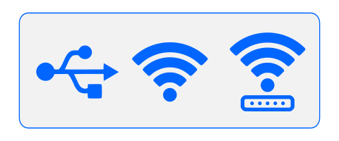

# Forma de conectar a sua Carbon

A Carbon oferece três maneiras de se conectar ao seu computador:

<figure markdown="span">

  { width="480" }
  <figcaption>[Imagem 1: Conexões USB e Wi-Fi]</figcaption>

</figure>

* Conexão via cabo USB
* Conexão Wi-Fi - Rede Carbon
* Conexão Wi-Fi - Rede local de trabalho

## Conexão via USB

Neste método, a conexão entre a máquina e o computador é estabelecida diretamente através de um cabo USB.

A versão mais recente do Carbon Studio já inclui automaticamente o Driver do Cabo USB. No entanto, se ao seguir o procedimento você notar que o Cabo USB não é reconhecido em nenhuma das portas do seu computador, faça o [download] do Driver CH340 e instale clicando em "Instalar".

[download]: https://gadgetpluskdb.github.io/Carbon-FAQS/transferencias/#driver

<figure markdown="span">

  { width="430" }
  <figcaption>[Imagem 2: Instalação do Driver USB]</figcaption>

</figure>

* Conecte o cabo USB entre o computador e a Gadget.

<figure markdown="span">

  { width="452" }
  <figcaption>[Imagem 3: Cabo USB]</figcaption>

</figure>

* Abra o Gestor de Dispositivos do seu computador e verifique se a Carbon foi reconhecida nas Portas COM. Para visualizar os dispositivos reconhecidos, clique na seta e confira se aparece "USB SERIAL CH340".

<figure markdown="span">

  { width="835" }
  <figcaption>[Imagem 4: Verificação de Reconhecimento]</figcaption>

</figure>

* Confirme se o ícone "Dados de conexão" está verde no Carbon Studio. Se estiver, você já está conectado à Gadget via Cabo USB!

<figure markdown="span">

  { width="309" }
  <figcaption>[Imagem 5: Verificação de Conexão]</figcaption>

</figure>

## Conexão Wi-Fi - Rede Carbon

Neste método, você conecta o computador à Carbon através de uma rede Wi-Fi criada pela própria máquina.

Vantagem: Mobilidade, sem a necessidade de cabos. Rede Wi-Fi estável.

Desvantagem: Seu computador perde acesso à rede Wi-Fi do local de trabalho, pois precisa se conectar à rede gerada pela Carbon, que não proporciona acesso à Internet, logo o seu computador fica sem internet.

* Encontre a rede "Carbon" na lista de redes disponíveis do seu computador.

<figure markdown="span">

  { width="365" }
  <figcaption>[Imagem 6: Rede Wi-Fi Gadget]</figcaption>

</figure>

* A senha para essa rede é sempre "C4rbon!!".

<figure markdown="span">

  { width="370" }
  <figcaption>[Imagem 7: Senha da Rede Wi-Fi Gadget]</figcaption>

</figure>

* Confira se o ícone "Dados de conexão" está verde no Carbon Studio. Se estiver, você já está conectado à sua máquina via Wi-Fi Carbon!

<figure markdown="span">

  { width="531" }
  <figcaption>[Imagem 8: Verificação de Conexão]</figcaption>

</figure>

## Conexão Wi-Fi - Rede local de trabalho
Neste método, você conecta a Carbon à rede Wi-Fi do seu local de trabalho.

Importante: Para configurar a conexão com a rede Wi-Fi do local de trabalho, é necessário se conectar inicialmente via Cabo USB ou Wi-Fi Carbon.

Vantagem: Mobilidade, sem a necessidade de cabos. Permite acesso à Internet pela rede Wi-Fi do local de trabalho. Facilita a conexão de diferentes computadores à máquina.

Desvantagem: Esta conexão depende do sinal Wi-Fi do local de trabalho e pode ser mais instável.

Dica: Procure trabalhar o mais proximo do seu router de forma a garantir um sinal de Wi-fi estável.

* No Carbon Studio, clique no ícone Configurações na Barra de Controle.

<figure markdown="span">

  { width="269" }
  <figcaption>[Imagem 9: Configuração Wi-Fi]</figcaption>

</figure>

* No separador Wi-Fi, clique em Atualizar. O Carbon Studio mostrará todas as conexões disponíveis em seu local.

<figure markdown="span">

  { width="657" }
  <figcaption>[Imagem 10: Lista de redes]</figcaption>

</figure>

* Escolha a rede Wi-Fi do seu local de trabalho e clique em Conectar.

* Insira a senha da sua rede, se solicitado, e clique em Aplicar.

<figure markdown="span">

  { width="657" }
  <figcaption>[Imagem 11: Conectar Wifi Local]</figcaption>

</figure>

* Se você estava conectado à rede Wi-Fi Carbon para configurar sua máquina, agora pode retornar à sua rede local.

* Confira se o ícone "Dados de conexão" está verde no Carbon Studio. Se sim, a máquina está conectada à sua Rede Local.

<figure markdown="span">

  { width="270" }
  <figcaption>[Imagem 12: Verificação de Conexão]</figcaption>

</figure>

<!--
Assista ao vídeo sobre as formas de conectar a sua Gadget:

[Link para o vídeo]
-->

Neste artigo, aprendemos as formas que a Carbon pode se comunicar com o computador e observamos as vantagens e desvantagens de cada uma. Agora você já pode avaliar qual conexão melhor atende você e as suas necessidades.

Teve algum problema na hora de se conectar? Que tal dar uma olhadinha nesses artigo de troubleshooting divididos por tipo de conexão.

* Troubleshooting - [Cabo USB]
* Troubleshooting - [Rede Wi-fi Carbon]
* Troubleshooting - [Rede Wi-fi local de trabalho]

[Cabo USB]: https://gadgetpluskdb.github.io/Carbon-FAQS/studio/conex%C3%A3o-computador/#conexao-via-usb

[Rede Wi-fi Carbon]: https://gadgetpluskdb.github.io/Carbon-FAQS/studio/conex%C3%A3o-computador/#conexao-wi-fi-rede-carbon

[Rede Wi-fi local de trabalho]: https://gadgetpluskdb.github.io/Carbon-FAQS/studio/conex%C3%A3o-computador/#conexao-wi-fi-rede-local-de-trabalho
