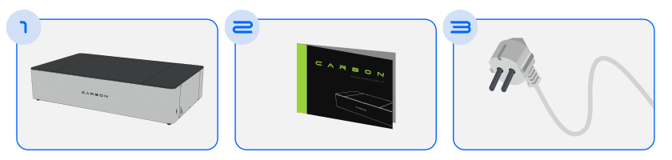
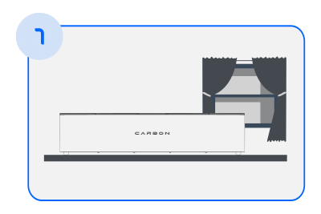
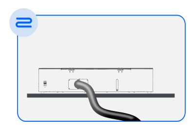
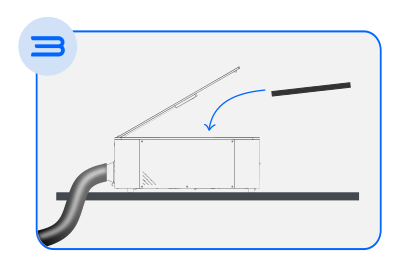
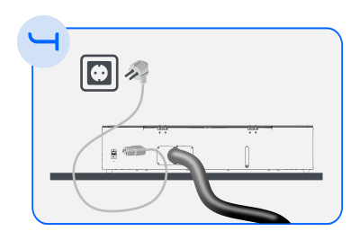

# Como instalar a sua maquina "Primeiros passos"

<!--
<figure markdown="span">
  
  { width="610" }
  <figcaption></figcaption>

  { width="610" }
  <figcaption></figcaption>
  
</figure>
-->

A sua Carbon acabou de chegar e agora é hora de começar a instalação!

Para tornar esse processo mais fácil, a nossa equipa preparou um guia de instalação completo com todas as informações necessárias. Você pode fazer o download [aqui] ou encontrá-lo também na nossa página de suporte.

[aqui]: https://gadgetpluskdb.github.io/Carbon-FAQS/transferencias/

Neste artigo, vamos abordar o tema de forma mais abrangente, oferecendo algumas dicas úteis.

## Desembalando
Este é o momento em que você vai desembalar a sua Carbon e descobrir todos os itens que a acompanham!

Observação: Nossos produtos estão em constante melhoramento, então pode ser que alguns detalhes estejam diferentes, mas não se preocupe, aqui no artigo deixaremos tudo bem claro.

### Dicas para o desembalamento

É ideal desembalar a sua Carbon com a ajuda de outra pessoa, pois a máquina é pesada e requer cuidados.
Remova apenas os lacres, preferencialmente com um alicate de corte, mas uma tesoura afiada também serve!

## O que vem com a sua Carbon?

<figure markdown="span">

  { width="750" }
  <figcaption></figcaption>
  
  { width="750" }
  <figcaption></figcaption>

  { width="750" }
  <figcaption></figcaption>

</figure>

[Figura 1 - Itens que acompanham a Carbon]

* Carbon: A máquina de corte a laser, a estrela principal!
* Colmeia: Protege o fundo da máquina dos efeitos do laser.
* Mangueira de exaustão: Permite a exaustão dos gases tóxicos gerados durante o corte para fora do ambiente.
* Abraçadeira da mangueira: Reforça a fixação da mangueira.
* Funil: Auxilia no processo de enchimento do reservatório de água.
* Cabo de alimentação (220v 10A): Conecta a máquina à rede elétrica.
* Cabo USB: Permite a conexão da sua Carbon ao computador.
* Gabarito de foco: Auxilia no ajuste do foco do laser de acordo com o material utilizado.
* Manual de instruções Carbon + Guia de Manutenção

## Escolhendo o melhor lugar para sua Carbon

<figure markdown="span">

  { width="400" }
  <figcaption></figcaption>

</figure>

* Posicione a máquina em uma superfície firme e plana.
* É importante escolher um local próximo a uma janela ou saída de ar.
* Se você planeia usar sua Carbon conectada à rede Wi-Fi da sua casa, escolha um local próximo ao seu router para obter um bom sinal.

## Cuidando da exaustão

<figure markdown="span">

  { width="400" }
  <figcaption></figcaption>

</figure>

* Conecte uma das extremidades da mangueira de exaustão à parte traseira da máquina.
* Fixe-a com a abraçadeira.
* A outra extremidade da mangueira deve ser direcionada para uma janela ou saída de ar.
* Os gases liberados durante o corte podem ser tóxicos e prejudiciais à sua saúde, então preste atenção nesta etapa.

## Inserindo a proteção de fundo

<figure markdown="span">

  { width="400" }
  <figcaption></figcaption>

</figure>

* Abra a tampa da Carbon.
* Remova a fita de fixação da colmeia.
* Posicione-a no fundo da máquina, garantindo que o lado preto esteja para cima. Pode ver informação mais detalhada secção [colmeia].

[colmeia]: https://gadgetpluskdb.github.io/Carbon-FAQS/manual/primeiros-passos/colmeia/

## Conectando à rede elétrica

<figure markdown="span">

  { width="400" }
  <figcaption></figcaption>

</figure>

* Conecte o cabo de alimentação entre a saída traseira da máquina e uma tomada comum de 10A com a tensão especificada na sua máquina 220V.
* É essencial que a rede elétrica tenha aterramento. A Carbon pode apresentar problemas no seu funcionamento e até mesmo ter componentes danificados se for ligada a uma instalação elétrica sem aterramento. Consulte mais informações na nossa secção [segurança] "Instruções de Tomadas".

[segurança]: https://gadgetpluskdb.github.io/Carbon-FAQS/seguran%C3%A7a/aterramento-tomadas/

* Ligue a Carbon.

Dicas:

Para verificar se o seu local de trabalho tem aterramento, entre em contato com um técnico especializado, como um eletricista.
Redes elétricas antigas podem não ter aterramento, então certifique-se disso.
Tomadas com apenas dois pinos não têm aterramento. Não use adaptadores na sua Carbon para esse tipo de tomada.
Neste artigo, aprendemos como instalar todos os componentes da nossa Carbon. A próxima etapa é prepará-la para uso, enchendo o reservatório de água!

Não deixe de acompanhar o próximo artigo desta série: [Encher Reservatório].

[Encher Reservatório]: https://gadgetpluskdb.github.io/Carbon-FAQS/manual/primeiros-passos/encher-reservat%C3%B3rio/