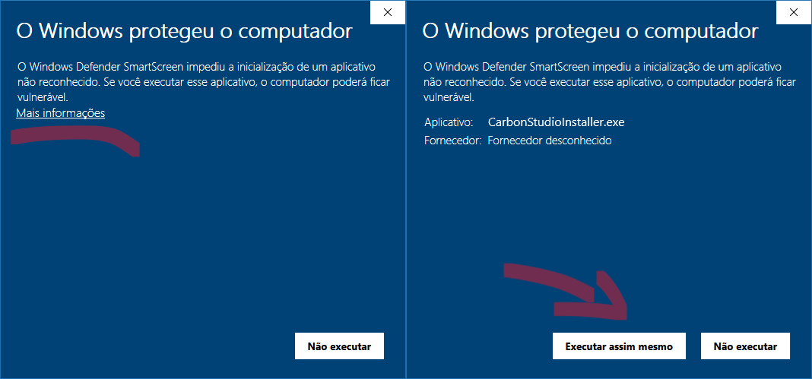

# Instalação do Carbon Studio

Neste guia, vamos explicar como você pode instalar os programas necessários para usar a sua Gadget no Windows 10 ou em versões mais recentes.

## Software Carbon Studio

O Carbon Studio é uma versão melhorada do Inkscape, projetada especificamente para facilitar o uso da sua Carbon. Atualmente, está disponível apenas para sistemas operativos Windows 10 ou superiores.

## Instruções para instalar o Carbon Studio
<!--
Você pode seguir as instruções deste vídeo:

[Vídeo 1: Instalando e utilizando o Carbon Studio.]

Ou, se preferir, siga os passos abaixo:
-->

* Acesse a página de [downloads] do software.
* Escolha o link do Carbon Studio compatível sua Carbon.
* Será redirecionado para uma página no Google Drive. Clique em ==Transferir== > ==Transferir mesmo assim== para iniciar o download. ==Fig 1:==

[downloads]: https://egadgetpluskdb.github.io/Carbon-FAQS/transferencias/

<figure markdown="span">

   { width="504" }
   <figcaption>Figura 1: Alerta Google Drive.</figcaption>

</figure>

!!! info "Aviso Antivírus"
      
      Caso seu navegador ou antivírus identifique o programa como “Malicioso” ou “Desconhecido”, você pode prosseguir com o download. O Carbon Studio é seguro e livre de vírus.

* Após o download, execute o programa descarregado.
* Se uma mensagem de segurança do Windows aparecer, clique em ^^Mais informações^^ e de seguida ==Executar assim mesmo==

<figure markdown="span">

   { width="800" }
   <figcaption>Figura 2: Alerta de Segurança do Windows.</figcaption>

</figure>

!!! success "Pode continuar"

      Clique em ==Executar assim mesmo== para abrir o instalador. ==Figura: 2==

<figure markdown="span">

   { width="480" }
   <figcaption>Figura 3: Permissão Administrador.</figcaption>

</figure>

* Se solicitado, conceda permissões de administrador para concluir a instalação. ==Figura 3:==
* No instalador siga as instruções das figuras a baixo.
* Quando o processo terminar, clique em ==Concluir==.

<figure markdown="span">

   { width="380" }
   <figcaption>Figura 4: Instalar</figcaption>
  
   { width="625" }
   <figcaption>Figura 5: Instalar</figcaption>

   { width="625" }
   <figcaption>Figura 6: Instalar</figcaption>

   { width="625" }
   <figcaption>Figura 7: Instalar</figcaption>

   { width="625" }
   <figcaption>Figura 8: Instalar</figcaption>
  
</figure>

* Pronto, o Carbon Studio está instalado no seu sistema!

Quer aprender mais sobre como utilizar o software? Avance para anossa série de artigos sobre o Carbon Studio [Aqui].

[Aqui]: https://egadgetpluskdb.github.io/Carbon-FAQS/studio/altualiza%C3%A7%C3%A3o-software/

Você aprendeu como instalar os software necessário para controlar a sua Carbon no Windows 10 ou em versões mais recentes. Agora, o próximo passo é [conectar] a sua Carbon ao computador.

[conectar]: https://gadgetpluskdb.github.io/Carbon-FAQS/manual/primeiros-passos/conex%C3%A3o-computador/