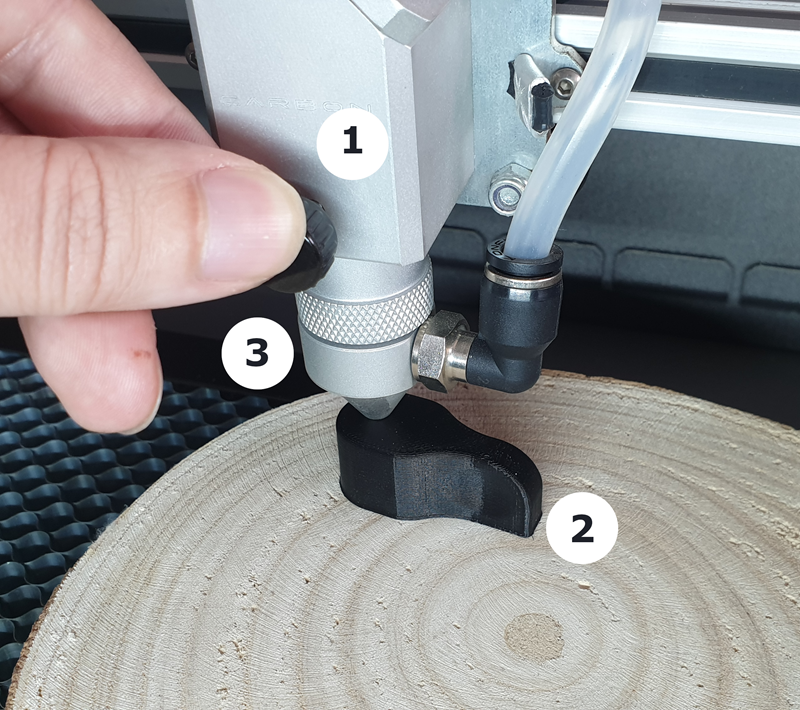

# Como ajustrar o foro do laser

Hoje, vamos abordar um passo crucial para garantir o sucesso dos nossos cortes:

O ajuste de foco.

### Mas afinal, por que é tão importante ajustar o foco?

Para entendermos a relevância desse procedimento, é essencial compreender que, antes de atingir o material, o laser passa por uma lente! Essa lente tem a função de concentrar a energia do laser em um ponto específico (o foco ideal), assegurando um corte preciso na sua Carbon.

<figure markdown="span">

  { width="800" }
  <figcaption></figcaption>

  { width="800" }
  <figcaption></figcaption>

</figure>

Figura 1 - Foco ideal

Manter a mesma distância entre o foco do laser e a superfície do material é fundamental. Para garantir essa precisão, utilizamos o nosso gabarito de foco!

## Ajustando o foco

O processo de ajuste de foco é simples:

<figure markdown="span">

  { width="600" }
  <figcaption></figcaption>

</figure>

1. Desaperte o bico do laser
2. Ajuste a altura do bico em relação à superfície do material usando o gabarito de foco
3. Aperte novamento o bico na nova posição.

!! tip "Dicas"
    
    * Evite pressionar o material durante o ajuste do foco
    * Verifique se o material está nivelado

## Quando devo ajustar o foco?

É crucial ajustar o foco sempre que mudar o tipo de material. Também é importante verificar se está ajustado caso o corte não atingir a qualidade desejada (veja a figura 2).

É comum esquecer de ajustar o foco, mesmo para os mais experientes. Esteja atento!

## Como saber quando meu foco não está regulado?

A melhor forma de perceber quando o foco não está regulado é observar a espessura da linha de corte. Quando não está regulado, a linha de corte fica visivelmente mais grossa do que o normal, o que pode resultar em um corte inadequado ou com acabamento deficiente (veja a figura 2).

<figure markdown="span">

  { width="600" }
  <figcaption></figcaption>

</figure>

Figura 2 - Exemplos de foco mal regulado

Neste artigo, aprendemos sobre a importância de ajustar o foco e como é fácil fazê-lo! Agora, basta ficar atento e não esquecer de realizar este procedimento sempre que trocar de material.

Acompanhe nossa série de artigos de primeiros passos para aprender como posicionar o [material] na Carbon.

[material]: https://gadgetpluskdb.github.io/Carbon-FAQS/manual/primeiros-trabalhos/material/