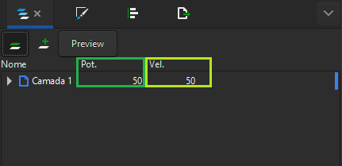

# Parametros de velocidade e potência

O processo de corte a laser requere a definição precisa de dois parâmetros fundamentais: velocidade e potência. Vamos explorar mais detalhadamente o significado desses fatores e aprender como ajustá-los para otimizar os resultados.

## Entendendo os parâmetros

### Velocidade:

  Refere-se à rapidez com que o feixe do laser se desloca pela área de trabalho, determinando a eficiência do corte ou gravação.
  Analogia com o fogo: Quanto mais tempo o fogo permanecer em um mesmo ponto (velocidade mais lenta), maior será a profundidade da queima no material.

### Potência:

Indica a intensidade da energia emitida pelo laser, influenciando diretamente na capacidade de corte ou gravação.
Analogia com o fogo: Uma potência mais elevada se assemelha a um fogo mais intenso, resultando em uma ação de corte ou gravação mais pronunciada.

A combinação adequada desses parâmetros (velocidade e potência) é crucial para alcançar o equilíbrio entre a eficácia do corte e a qualidade do acabamento.
A busca esse ponto de equilíbrio é essencial para obter resultados consistentes e satisfatórios.

<figure markdown="span">

  { width="220" }
  <figcaption></figcaption>

  { width="220" }
  <figcaption></figcaption>

</figure>

<em>Figura 1 - Relação entre velocidade e potência</em>

* Quanto maior a velocidade e menor a potência, menor será a profundidade do corte ou gravação.
* Quanto menor velocidade e uma maior potência resultarão em uma ação mais profunda.

## Configuração dos parâmetros no Carbon Studio

Os parâmetros são ajustados de acordo com a camada selecionada no software, disponível na interface à direita da tela. A precisão na definição desses parâmetros é essencial para garantir o sucesso do processo de corte ou gravação.

<figure markdown="span">

  { width="431" }
  <figcaption>Figura 2 - Definição de parâmetros</figcaption>

</figure>

## Encontrando os melhores parâmetros para o seu material

### Identificar os parâmetros ideais requer uma abordagem prática e experimental.

Devido à variedade de materiais e suas características específicas, é importante realizar [testes para determinar as configurações mais adequadas].

[testes para determinar as configurações mais adequadas]: https://gadgetpluskdb.github.io/Carbon-FAQS/truques-%26-dicas/testes-parametros/

### Para facilitar esse processo, desenvolvemos gabaritos de corte!

Esses gabaritos permitem testar diversas combinações de parâmetros, ajudando a identificar a configuração ótima para cada tipo de material. Além disso, [disponibilizamos] alguns arquivos no Carbon Studio para simplificar esse processo de testes e ajustes.

[disponibilizamos]: https://gadgetpluskdb.github.io/Carbon-FAQS/transferencias/#arquivos-para-testes-de-parametros

Neste artigo aprofundamos nosso entendimento sobre os parâmetros de velocidade e potência, exploramos como configurá-los no Carbon Studio e reconhecemos a importância dos testes práticos para determinar os ajustes ideais. Essas informações são fundamentais para garantir resultados consistentes e de alta qualidade no processo de corte a laser.
