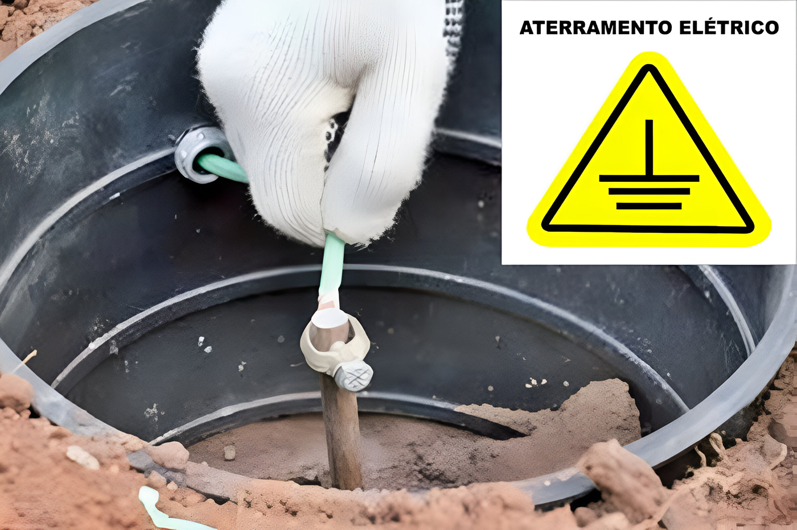
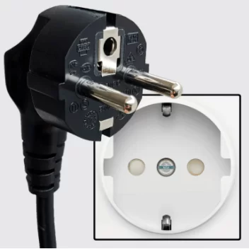

# Por que é necessário o aterramento nas tomadas?

Certamente, já deves ter ouvido falar acerca do conceito de aterramento em tomadas, certo?
De forma simples, o sistema de aterramento implica uma viga cravada no solo, conectada a um fio, geralmente nas cores verde e amarela, que percorre toda a casa, como exemplificado na imagem abaixo:

<figure markdown="span">

  { width="500" }
  <figcaption>Imagem 1: Aterramento da tomada</figcaption>

</figure>

As tomadas de 3 pinos geralmente sinalizam a presença de aterramento, mas é crucial confirmar se a rede elétrica do prédio ou casa está efetivamente aterrada. Pode ocorrer de não haver nenhum fio conectado a este pino, resultando na falta de aterramento da tomada.

## Então, por que é tão relevante o aterramento?

O aterramento da tomada tem como principal objetivo reduzir as variações de tensão na rede elétrica, eliminar fugas de energia e proteger os utilizadores contra possíveis choques elétricos. Ele previne que ocorram choques ao utilizar eletrodomésticos em casa, por exemplo.

No caso da tua Carbon, o aterramento não é apenas uma questão de segurança, mas também influencia o funcionamento da máquina. O laser CO2 requer uma alta tensão (20.000 volts), gerando um campo eletromagnético que induz uma corrente. Esta corrente deve ser direcionada para o aterramento; sem ele, pode acabar indo para a placa de controlo da máquina, prejudicando o correto funcionamento da tua Carbon ou, até mesmo, danificando componentes.

## Como posso verificar se a minha tomada possui aterramento?

!!! warning "Verificar"

    **Visualmente:** Podes confirmar se a tomada possui 3 fios conectados (apesar de isso não garante totalmente o aterramento, se houver apenas dois fios, confirma que não possui).

!!! warning "Cuidado"

    **Verificar** os fios dentro da tomada requer muita atenção para evitar choques elétricos. Recomendamos que um eletricista realize esta verificação, com cuidados adicionais, como desligar o quadro de energia e não tocar nos fios.

<figure markdown="span">

  { width="500" }
  <figcaption>Imagem 3: Exemplo de tomada com três fios conectados</figcaption>
  
</figure>

## Quais são os sinais de que a minha tomada não possui aterramento?

A ausência de aterramento na rede elétrica pode resultar em alguns problemas ao usar a tua Gadget Carbon, sendo os principais:

1.	Leve choque ao tocar na carcaça da máquina.
2.	Perda de conexão ou interrupção do trabalho sem aviso no Carbon Studio.
3.	Aparecimento de linhas aleatórias durante um trabalho, não presentes no arquivo ou no preview.
4.	Perda de passos devido à influência de alta tensão nos motores ou na placa controladora.
5.	Danos a componentes eletrônicos devido a fugas e variações de energia.

Outro ponto importante é o uso de extensões de energia, muitas das quais possuem o terceiro pino, destinado ao aterramento, mas podem não ter um terceiro fio em sua fiação interna. Sempre que possível, recomenda-se o uso de filtros de linha com aterramento ou conectar o cabo de energia diretamente na tomada da tua Carbon.

!!! warning "Importante"

    De acordo com os nossos termos de garantia, a utilização da máquina em locais sem aterramento resultará na perda total da garantia.